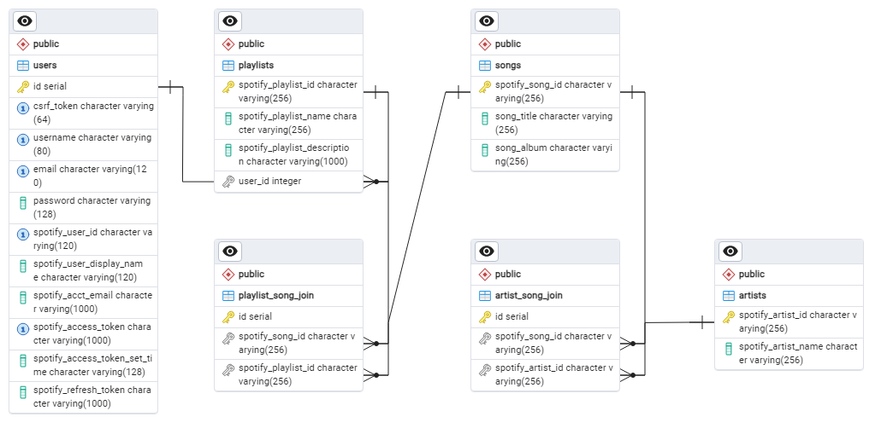

# Project Title:PlaySpotPlay
- a full-stack application that integrates the Spotify API for the application user to create playlists, search Spotify for songs, and add songs to their playlists and integrate those changes directly to their Spotify account.

Many people use Spotify daily for listening to music to podcast to audiobooks. The main Spotify interface can be a bit clunky and difficult for users to add different playlists and to modify those playlists by adding content. This application seeks to streamline this process by integrating with the spotify API and providing clear links for adding playlists, searching for songs and reviewing your basic Spotify account information.

## Deployment Information

This application has been deployed using Render.com and can be found at: https://playspotplay.onrender.com/

## Standard User Flow

A user will land on the homepage. This page provides the user with the option to sign-up or to login. The page requires a user to create an account in order to use it. When the user creates an account they will automatically be redirected to link to their Spotify Account. If a user chooses not to link their Spotify account they will be redirected to link their account and warned that the application cannot be utilized without this link. The link to Spotify relies on Oath 2.0 authentication. Once a user successfully links their Spotify account they have the ability to view their Spotify profile information, look at their existing Spotify playlists, create a new Spotify playlist, search for songs through Spotify and add those songs to any of their existing playlists. The website is set to redirect to login for any user that is not set at the g.user. Once done the user can logout of the application.

## Technologies Utilized

This application primarily utilizes: Python, Flask, HTML, PostgreSQL, and CSS. It has many package dependencies that can be found in the requirement.txt file. Some of the libraries included in this application are WTForms and SQLAlchemy. It also is integrated with the Spotify API for web development. This API requires Oath 2.0 authentication routes to be developed and utilized.

## API Integration

This application utilizes the Spotify API for web development. This API requires Oath 2.0 authenitcation. The API has much more functionality than has been implemented in this application and is a straightforward API to utilize once authentication is properly in place.

## Setup for Application outside of Render Deployment

In order to utilize this application from a clone the following things must be done:
- clone repository to your system
- setup environmental variables:
    - For database connection: 'playspotplay_connection', 'postgresql:///playspotplay'
    - For Spotify API: 'spotify_client_id',''
        - Please note that a spotify client id is required from the Spotify Web Development API website. Go to the following website and follow the steps to get your own client id:  	[Spotify Web API](https://developer.spotify.com/documentation/web-api)
- Spotify Web API setup:
    - Once you have your Spotify client id, you will also need to set the redirect uri on the Spotify website for your application. This must be precise or the application will not work as expected. An example for this is http://localhost:5000/auth/redirect_to_playspotplay, where /auth/redirect_to_playspotplay is the route that has been established in this application.
    - Please Note: It is very important that your client id and your redirect uri are setup on the Spotify Web API website for this application to work. Failure to do so will result in the Oath 2.0 authorization failing and the application not working.
- For the user_playlist_display.py model you will need to setup a view in your database to have it work properly and have your playlists display within the application.
    - Note this is a view model for displaying the playlist information for a user, to get around the issues with SQLalchemy and to avoid many many calls to the database this was created and implemented. For a production server the following will need to be done on the database for proper application functionality.

        - Create View from Database using the following Query
        
            create or replace view user_playlist_display as

            select distinct
                a.user_id,
                a.spotify_playlist_id,
                a.spotify_playlist_name,
                b.spotify_song_id,
                b.song_title,
                b.song_album,
                e.spotify_artist_name
            from playlists a
                join playlist_song_join c on (a.spotify_playlist_id = c.spotify_playlist_id)
                join songs b on (c.spotify_song_id = b.spotify_song_id)
                join artist_song_join d on (c.spotify_song_id = d.spotify_song_id)
                join artists e on (d.spotify_artist_id = e.spotify_artist_id) 

        - Regrant permissions to database user using the following grant command

            grant all privileges on all tables in schema public to playspotplay
- Good Luck!

## Database Schema

The database schema for this application is as follows: 

## Project Background
### Capstone Project One:Overview

For your first Capstone Project, you’ll build a more complex database-driven website. This website will be powered either an external API or an API that you build yourself. Your finished capstone will be an integral part of your portfolio; it will demonstrate to potential employers everything you’ve learned from this course.

We want you to work on a challenging project that will incorporate all of the full stack skills you’ve been developing. The goal of this project isn’t to create something that’s never been done before, but should be more ambitious than your last capstone. You could potentially create a website similar to one that already exists, but this time, perhaps add a feature that you wish the website had. We encourage you to be creative when building your site. You’re free to choose any API you’d like to use or build your own. We encourage you to tap into your imagination throughout the project

### Examples
You already know about the wealth of APIs available online. Perhaps on this capstone, you can work on one of your ideas that was a bit too complicated for the last project. We also encourage you to create your own API if you cannot find one with the data you are looking for. You can do this through webscraping, importing a CSV, or loading your own data into the API.

Let’s give you an example of what a site could look like. Say you want to make a website or mobile app that is like Facebook for dogs - something that would allow pet owners to connect with other pets in their neighborhood. First, you could load information into the application about various breeds of dogs, which would populate dropdown lists and allow users to sort for the kind of dog they would like to sit. This will help users build the profile for their animal. You could add forms with various information about the pets. You could allow them to upload pictures (dog owners love nothing more than to take pictures of their animals). Most importantly, you could allow the pets to connect with other pets through a graph.

Now let’s talk about bells and whistles. What if a user of your Dog book was leaving town and wanted to find users in their neighborhood to watch their dog for the weekend. You could implement a geographical filtering and simple messaging or request system in order to help Spot find the best petsitter. And since no one wants their dog watched by some kind of monster, you could implement reviews to see if people recommend this sitter.

There’s a million different features you could add! Verified users, so celebrities could show off their dogs. The actor who plays the Mountain on Game of Thrones has an adorable pomeranian and people demand picture proof! You could implement an adoption system. Of course, adding in all of these features would be beyond the scope of this project, but you should expect this app to have more functionality than the last Capstone.
 
### Guidelines
- You will use the following technologies in this project: Python/Flask, PostgreSQL, SQLAlchemy, Heroku, Jinja, RESTfulAPIs, JavaScript, HTML, CSS. Depending on your idea, you might end up using WTForms and other technologies discussed in the course.
- You complete all steps of the project via a Hatchways GitHub repository. Your mentor will be able to comment on your project ideas and proposal and review your work in the repository.
- The first two steps of the Capstone project will have submissions that will require mentor approval to proceed.
- For the next 4 steps of the Capstone project, you will be directed to the Hatchways platform and these will be evaluated by the Hatchways Grader. You do not need these projects to be approved by the mentor.
- If you get stuck, there is a wealth of resources at your disposal. The course contains all of the material you will need to complete this project, but a well-phrased Google search might yield you an immediate solution to your problem. Don’t forget that your Slack community, TAs, and your mentor are there to help you out.
- Make sure you use a free API or create your own API and deploy your project on Render, so everyone can see your work.

### Project Steps:
We have broken down the Capstone Project into easy-to-follow steps. Each step of the capstone contains a link with instructions for that step. You will be completing your capstone project on the Hatchways platform. Here’s a quick overview of what you’ll do for each step of your capstone project:

1. Step One: Initial Project Ideas: You’ll pick up to 3 project ideas to propose to your mentor and the Springboard community. You’ll also explore some potential APIs.

*In my application file under Completed_Project_steps you will find my initial_project_ideas.md file. This contains my original ideas that were shared and discussed with my Springboard mentor.*

2. Step Two: Project Proposal: For this step, you’ll write a proposal for the site you want to build. This will help your mentor better understand your chosen capstone project idea.

*In my application file under Completed_Project_steps you will find my project_proposal.md file. This contains my project proposal that was shared and discussed with my Springboard mentor.*

3. Step Three: Source your Data: After your mentor approves of your capstone project proposal, you’ll figure out the database design of your application and which API you’ll be using.

*In my application file under models you will find my basic models for data in my application and how those models are connected. The basic schema after completion of the project is as follows:*

4. Step Four: Coding User Flows:Once you’ve figured out what you’re building, you’ll write the code to implement it. It’s important to think about what you want a user’s experience to be like as they navigate your site.

*My user flows can be followed in the app.py and in the spotify_auth.py files.*

5. Step Five: Polishing Your Application: Once you have the core functionality implemented, you’ll focus on additional UI enhancements and styling for your application. When you finish this step, you will be done with the code base.

*Due to time constaints and difficulties encountered with the various aspects of Oath2 implementation and database integration, I have been advised by my advisor to turn in my Capstone in a simplified cleaned up version that does not contain the original functionality I had hoped to achieve. This application is still much more complicated that applications I have created in the past and does show substantial growth in design and programming ability.*

6. Step Six: Documenting and Submission: You’ve done a lot of work so now it’s time to show your mentor your progress! Create a README in markdown, make sure your GitHub is organized, and submit your finalized project.